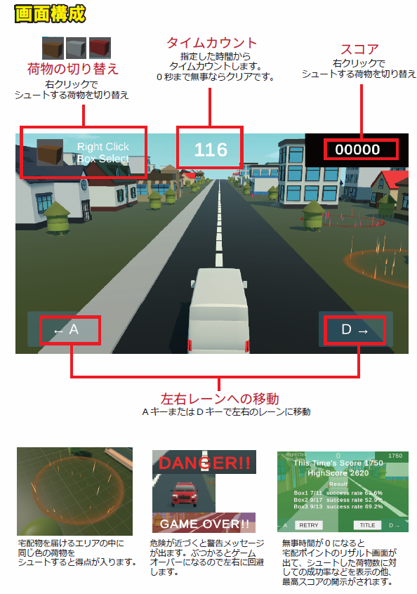

# ゲーム概要
直進し続ける宅配トラックから、指定された位置へ荷物を届けるゲーム<br>
シンプルな操作で遊べるので、たくさん荷物を届けて高得点を狙いましょう！<br>
対向車は車線変更で避けないとゲームオーバーになるので注意！

# 使用技術
- GitHub
- Unity ver.2022.3.62f1
- C#
- VisualStudio
- Unity Asset
  - Low poly vehicle Pack lite
  - Pandazole - City Town Lowpoly Pack
  - Area of Effect Spell FREE

※ Unityバージョンは以下を考慮して最新バージョンを避けました。
- 既存アセットの対応状況
- CinemaShineの操作方法


# 制作目的
Unityの3Dゲーム開発技術の習得を目的に、様々な3D技術を組み合わせた内容としました。
- マウス操作とカメラ視点の連動
- 視点の先に宅配物を投げる
- 宅配先へのエフェクトの適用

# ゲーム企画




# 設計

# 工夫

## ChinemaShineの活用

### CinemaShineコンポーネントを使用して、タイトル画面、ゲームクリア画面ではダイナミックなカメラワークに切り替わるようにしています。
<br>

## SkyBoxやLightingの調整

### ステージごとにSkyBoxやLightingの調整を行い、雰囲気を大きく変えることで飽きづらくしています。
<br>

## 3種類の宅配物

### 宅配物を切り替えて、ゴールの色に合わせた宅配物を配達するルールが、プレイヤーに適度な慌ただしさを提供します。

Shooter.cs抜粋
``` c#
public GameObject[] boxPrefabs; //宅配物のプレハブを格納
//生成対象のBoxの切り替え
if (Input.GetMouseButtonDown(1))
{
    boxNum++;
    if (boxPrefabs.Length == boxNum) boxNum = 0;
}
```

Post.cs抜粋
``` c#
private void OnTriggerEnter(Collider other)
{
    if (!posted)
    {
        switch (type)
        {
            case PostType.box1:
                if (other.gameObject.CompareTag("Box1"))
                    //宅配完了の処理
                    PostComp();
                    break;
            case PostType.box2:
                if (other.gameObject.CompareTag("Box2"))
                    //宅配完了の処理
                    PostComp();
                    break;
            case PostType.box3:
                if (other.gameObject.CompareTag("Box3"))
                    //宅配完了の処理
                    PostComp();
                    break;
        }                        
    }
}
```
## 宅配成功率の計算

### ゲームクリア画面に宅配物ごとの配達成功率を表示することによって、単に高得点を目指すこと以外にもやりこんで楽しんでもらえるようにしました。


``` c#
//ハイスコアの更新
                if (GameController.stagePoints > highScore)
                {
                    highScore = GameController.stagePoints;
                    PlayerPrefs.SetInt(currentStageName, highScore);                    
;               }
```
``` c#
//3つのBoxの成功率を表示
                for(int i =0; i < resultNames.Length; i++)
                {
                    float successRate;
                    if (Shooter.shootCounts[i] == 0) successRate = 0;
                    else
                    {
                        //Boxの計算 ※少なくとも片方はfloatにキャスト
                        successRate = ((float)Post.successCounts[i] / Shooter.shootCounts[i]) * 100f;
                    }
                    boxText[i].text = resultNames[i] + " " + Post.successCounts[i] + "/" + Shooter.shootCounts[i] + "  success rate " + successRate.ToString("F1") + "%";
                }
                GameController.gameState = GameState.timeover;
                //リザルトパネルの表示
                resultPanel.SetActive(true);
                //カーソルロックモードの解除
                Cursor.lockState = CursorLockMode.None;
                Cursor.visible = true;
```
# 今後の展望
- 荷物の着地の仕方で荷物の破損率を出す
- 限られた在庫から在庫切れを起こさないように配達する
- 走るスピードを自分でコントロールできるようにして、制限時間内に配り切る